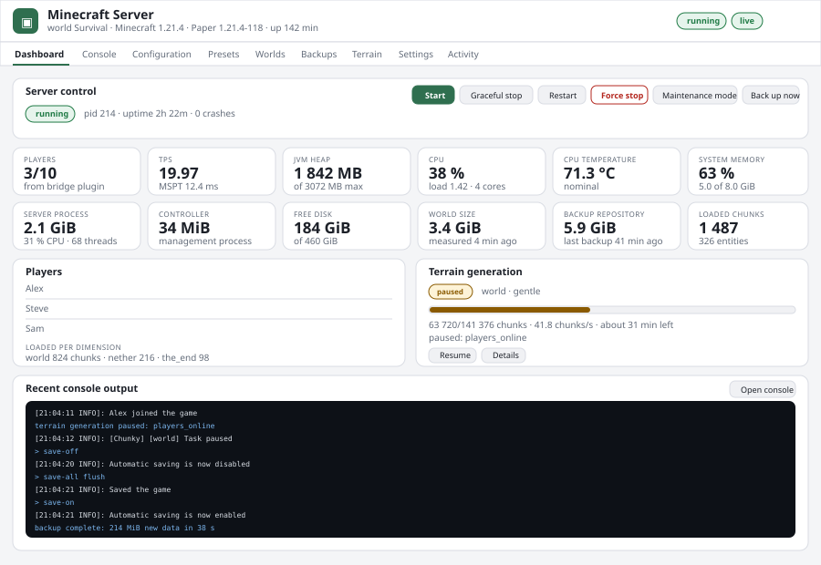
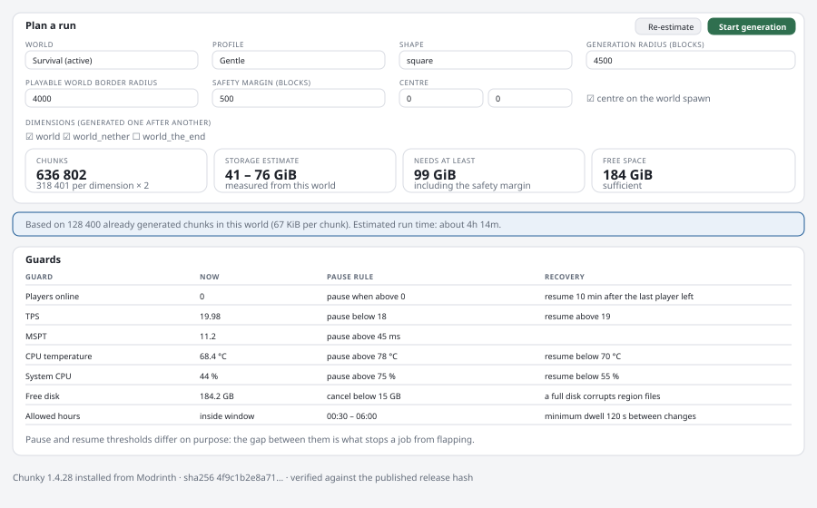

# Interface mockups and screenshots

`dashboard.svg` and `terrain.svg` are to-scale mockups of the real interface: same layout,
same wording, same metrics, with plausible values for a Raspberry Pi 5 running a small
survival server. They are checked in as SVG so they stay readable in a diff and need no
binary blobs in the repository.

## Capturing real screenshots

Screenshots of a live installation depend on your world, your hardware and your Home
Assistant theme, so they are not committed. To capture your own:

1. Open the add-on's Web UI through Ingress.
2. Use your browser's full-page capture (Firefox: right-click → *Take Screenshot* → *Save
   full page*; Chromium: DevTools → command palette → *Capture full size screenshot*).
3. Save as PNG into this directory and reference it from the documentation.

For a clean shot without live data, run the controller locally with `scripts/dev.sh`: the
interface renders the same, just with an empty world and no bridge telemetry.

The interface follows the browser's light or dark preference, so capture whichever matches
the documentation you are writing.
